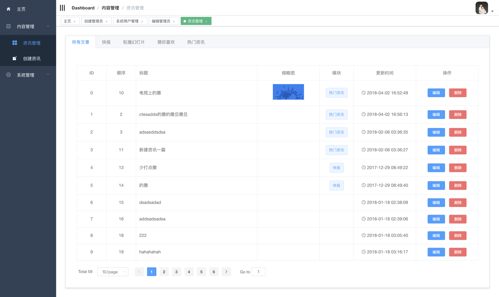

# A Simple Content Manage System

# Preview

# How to use
* `python3 install pipenv`
* `pipenv install && pipenv shell`
*  edit `/flask_server/config.py` 
* `invoke rundev` can run develop environment both front-end and back-end
* `invoke test` can run unittests
*  edit `tasks.py`, and then `invoke deploy` can deploy product environment
* `invoke freeze` to freeze static files

# Instruction
* In Front-End, the dir `admin_with_vue` is based on [vue-element-admin](https://github.com/PanJiaChen/vue-element-admin), you can follow to develop. When you run `npm run build`, need to copy `/admin_with_vue/dist` to `/flask_server/static`
* In `config.py` , You can choose Redis to cache or not, and edit db connection
* When you run webserver, you also can see http://your host/apidocs/ to an Api doc, this is supported by [flasgger](https://github.com/rochacbruno/flasgger)